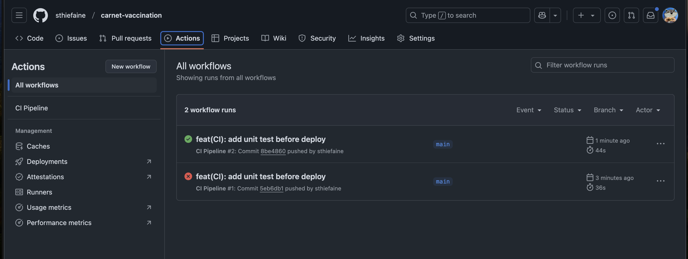

# Carnet-vaccination

Premier pas avec Vue js :

On va se servir de la formation de grafikart pour apprendre Vue js et la documentation vue ( on ne va pas directement partir sur NUXT mais vraiment vueJS et y ajouter des dependances ):
https://grafikart.fr/formations/vuejs
https://vuejs.org/guide/typescript/overview

l'idée est de créer un site web qui permet de gérer un carnet de vaccination simplement en s'inspirant du pdf d'ameli https://www.ameli.fr/sites/default/files/Documents/calendrier%20vaccinal%20simplifi%C3%A9%20avril%202024.pdf

## Debut de l'application et MVP

Mise en place du planing des vaccinations

MVP :

- [x] Typer les données
- [x] Ajouter un selecteur d'age
- [x] Ajouter un store pour stocker les données et les transferer vers le tableau
- [x] scroll automatique horizontal dans le tableau suivant l'age
- [x] Ajouter une modale pour ajouter des vaccinations deja effectuées ou non par l'utilisateur
- [x] Stocker les données dans le local storage

### la suite, ajouter des fonctionnalités comme :

- l'utilisateur peut ajouter d'autres vaccins
- les donées sont stockées dans une base de données SQL postgresql
- ajouter des annimations sur le site

## Déploiement

Ajout d'une action github pour effectuer les tests unitaires avant dedéployer sur vercel pour ainsi securiser le deployment de la branche utilisée par défault "main"

